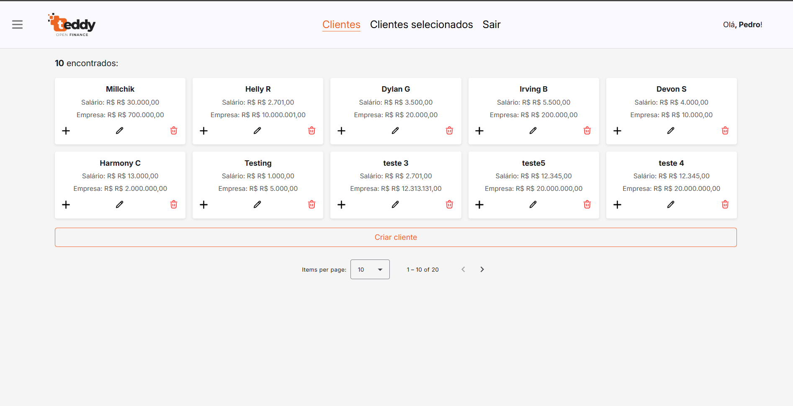

[TYPESCRIPT__BADGE]: https://img.shields.io/badge/typescript-D4FAFF?style=for-the-badge&logo=typescript
[ANGULAR__BADGE]: https://img.shields.io/badge/Angular-red?style=for-the-badge&logo=angular
[HTML5__BADGE]: https://img.shields.io/badge/html5-%23E34F26.svg?style=for-the-badge&logo=html5&logoColor=white
[CSS3__BADGE]: https://img.shields.io/badge/css3-%231572B6.svg?style=for-the-badge&logo=css3&logoColor=white
[PROJECT__BADGE]: https://img.shields.io/badge/📱Visit_this_project-000?style=for-the-badge&logo=project
[PROJECT__URL]: https://github.com/Fernanda-Kipper/Readme-Templates

<h1 align="center" style="font-weight: bold;">Teste Técnico [Teddy Open Finance]</h1>

![angular][ANGULAR__BADGE]
![typescript][TYPESCRIPT__BADGE]
![CSS3][CSS3__BADGE]
![HTML5][HTML5__BADGE]
[](https://lbesson.mit-license.org/)

<p align="center">
 <a href="#about">Sobre</a> • 
 <a href="#started">Como rodar a aplicação</a> • 
  <a href="#docker">Como rodar a aplicação via Docker</a> • 
  <a href="#tests">Testes</a> •
 <a href="#final">Considerações finais</a>
</p>

<p align="center">
    
</p>

<h2 id="about">📌 Sobre</h2>

Este projeto trata-se de um desafio técnico que compõe o processo seletivo para a vaga de Desenvolvedor Front End Pleno na Teddy Open Finance

<h2 id="started">🚀 Como rodar a aplicação</h2>


<h3>Pré-requisitos</h3>

Aqui estãos os pré-requisitos para rodar a aplicação:

- [Node](https://nodejs.org/pt)
- [Angular 19+](https://angular.dev/)
- [Git](https://git-scm.com/.)

Com todos os pré-requisitos instalados, podemos seguir o passo-a-passo abaixo:

<h3>1. Clonando</h3>

1. Abra o terminal (ou Git Bash no Windows).
2. Navegue até a pasta onde você deseja clonar o projeto.
3. Clone o repositório usando o comando <kbd>git clone</kbd>.

```bash
git clone https://github.com/pedroarthurcomh/teddy-open-finance-challenge.git
```
<h3>2. Instalando as Dependências do Projeto</h3>

1. Dentro da pasta do projeto, instale as dependências listadas no arquivo <kbd>package.json</kbd>:
```bash
npm install
```
Isso instalará todas as bibliotecas necessárias para rodar o projeto.

<h3>3. Rodando a aplicação</h3>

1. Após instalar as dependências, você pode rodar o projeto Angular utilizando o seguinte comando:

```bash
ng serve
# ou
npm start
```

2. O projeto será compilado e estará disponível no endereço:
```bash
http://localhost:4200/
```
3. Abra o navegador e acesse http://localhost:4200/ para visualizar o projeto.


<h2 id="docker">📍 Como rodar a aplicação via Docker</h2>

Você também pode rodar esta aplicação usando o Docker, caso o tenha. Aqui vai o passo-a-passo:

<h3>1. Construindo a Imagem Docker</h3>

1. Navegue até a pasta do projeto no terminal.
2. Construa a imagem Docker usando o Dockerfile:
```bash
docker build -t angular-docker .
```
3. Aguarde a construção da imagem. Isso pode levar alguns minutos.

<h3>1. Rodando o Docker Container</h3>

1. Após a construção da imagem, você pode rodar o contêiner com o seguinte comando:
```bash
docker run -p 80:80 angular-docker
```
2. Acesse a aplicação no navegador:
```bash
http://localhost:80
```

<h2 id="tests">📍 Testes</h2>

Para rodas os testes da aplicação também é muito simples:

1. Navegue até a pasta do projeto no terminal.
2. Rode o seguinte comando:
```bash
npm run test
```

<h2 id="final">🤝 Considerações finais</h2>

Gostaria de agradecer a oportunidade de participar desse processo seletivo. Com certeza foi um marco na minha carreira, e obtive muito aprendizado a partir disso.

<table>
  <tr>
    <td align="center">
      <a href="#">
        <br>
        <sub>
          <b>Pedro Arthur</b>
        </sub>
      </a>
    </td>
  </tr>
</table>